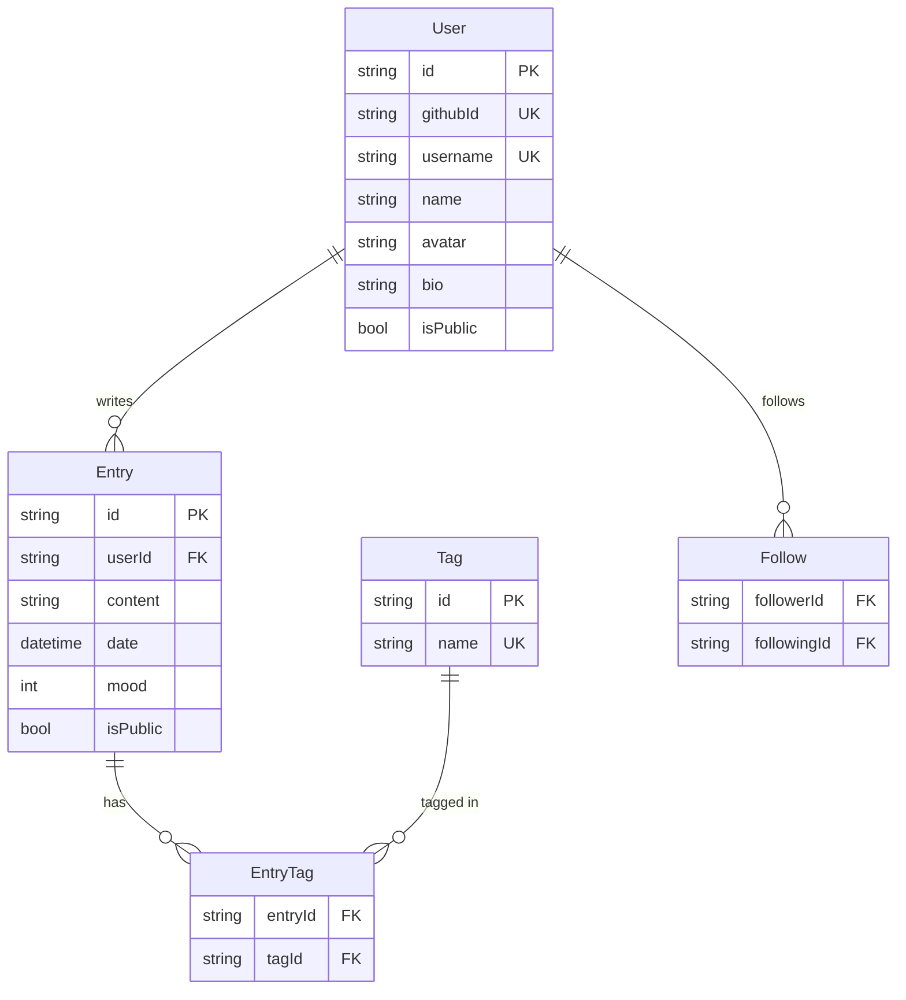

# DevLog

[](https://github.com/SultanZhalifa/devlog/actions/workflows/ci.yml)
[](https://www.typescriptlang.org/)
[](https://nextjs.org/)
[](https://supabase.com/)
[](LICENSE)

A developer progress-tracking platform — log what you learn and build daily, visualize your streaks like GitHub contributions, and optionally share your journey publicly.

**Live demo:** [devlog-sultanzhalifa.vercel.app](https://devlog-sultanzhalifa.vercel.app)

---

## Features

- **GitHub OAuth** — one-click sign in, no password needed
- **Daily entries** — write what you learned, built, or fixed; tag by technology
- **Mood tracking** — rate how the day felt (1–5 scale)
- **Streak calendar** — GitHub-style contribution heatmap showing your daily logging streak
- **Analytics dashboard** — entries-per-week line chart, top tags bar chart, streak stats
- **Public profiles** — shareable `/:username` page with public entries and stats
- **Explore feed** — discover what other developers are learning, trending tags
- **Dark mode** — respects `prefers-color-scheme`
- **Fully responsive** — works on mobile and desktop

---

## Tech stack

| Layer | Tech |
|-------|------|
| Framework | Next.js 16 (App Router, Server Components) |
| Language | TypeScript 5 |
| ORM | Prisma 7 |
| Database | PostgreSQL (Supabase) |
| Auth | Auth.js v5 (NextAuth) — GitHub OAuth |
| UI | Tailwind CSS v4 + shadcn/ui |
| Charts | Recharts |
| Testing | Vitest + React Testing Library |
| CI/CD | GitHub Actions |
| Deploy | Vercel |

---

## Database schema



---

## Getting started

### Prerequisites

- Node.js 20+
- A PostgreSQL database (free at [supabase.com](https://supabase.com))
- A GitHub OAuth App ([create one here](https://github.com/settings/applications/new))
  - Set callback URL to: `http://localhost:3000/api/auth/callback/github`

### Local setup

```bash
git clone https://github.com/SultanZhalifa/devlog.git
cd devlog
npm install

# Copy and fill in env vars
cp .env.example .env.local
# Edit .env.local with your DATABASE_URL, NEXTAUTH_SECRET, GITHUB_ID, GITHUB_SECRET

# Run database migrations
npx prisma migrate dev

# Start dev server
npm run dev
```

Open [http://localhost:3000](http://localhost:3000).

---

## Scripts

```bash
npm run dev          # Start dev server (Turbopack)
npm run build        # Production build
npm run typecheck    # TypeScript check (tsc --noEmit)
npm run lint         # ESLint
npm run format       # Prettier
npm test             # Vitest unit tests
```

---

## Tests

```bash
npm test
```

The test suite covers:

- **`calculateStreak`** — 8 cases: empty, single day, consecutive days, gaps, deduplication, stale entries
- **`EntryCard`** — renders content, tags, and conditional user info correctly

---

## Deployment

### Vercel + Supabase (recommended, both free)

1. Create a PostgreSQL database at [supabase.com](https://supabase.com)
2. Import this repo on [vercel.com](https://vercel.com/new)
3. Add environment variables in Vercel dashboard (same as `.env.example`)
4. Run `npx prisma migrate deploy` from your local machine pointing at the production DB

---

## Project structure

```
devlog/
├── src/
│   ├── app/
│   │   ├── page.tsx              # Landing page
│   │   ├── (auth)/login/         # Sign-in page
│   │   ├── dashboard/            # Logged-in home
│   │   ├── write/                # Entry editor
│   │   ├── analytics/            # Streak calendar + charts
│   │   ├── explore/              # Public feed + trending tags
│   │   ├── [username]/           # Public profile
│   │   └── api/
│   │       ├── auth/[...nextauth]/
│   │       ├── entries/          # GET, POST
│   │       ├── entries/[id]/     # GET, PUT, DELETE
│   │       ├── tags/             # GET trending tags
│   │       └── analytics/        # GET user analytics
│   ├── components/
│   │   ├── Navbar.tsx
│   │   ├── EntryCard.tsx
│   │   ├── TagBadge.tsx
│   │   ├── StreakCalendar.tsx
│   │   └── AnalyticsCharts.tsx
│   ├── lib/
│   │   ├── db.ts                 # Prisma client singleton
│   │   ├── auth.ts               # NextAuth config
│   │   └── utils.ts              # cn(), calculateStreak(), date helpers
│   └── types/index.ts
├── prisma/schema.prisma
├── tests/
│   ├── utils/streak.test.ts
│   └── components/EntryCard.test.tsx
└── .github/workflows/ci.yml
```

---

## License

[MIT](LICENSE) — Sultan Zhalifunnas Musyaffa
